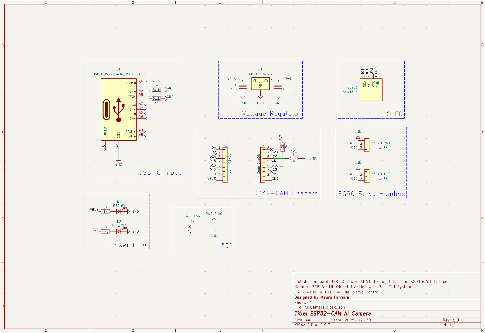
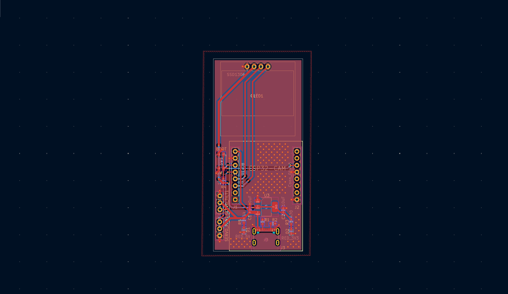
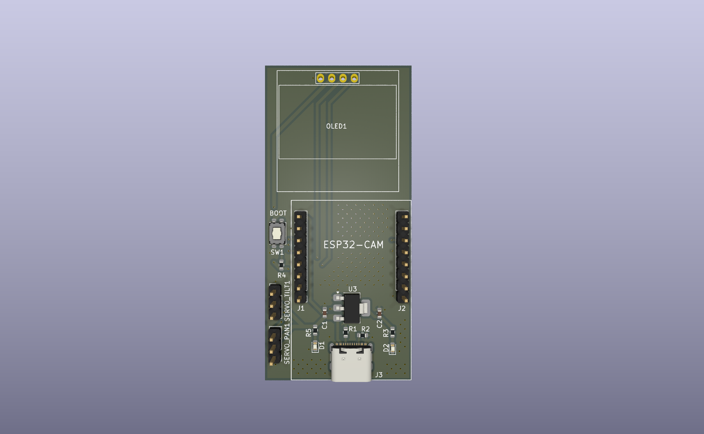

## ESP32 AI CAM (ESP32-CAM PCB with OLED & Servo Mount)

A compact, modular breakout PCB designed for the **ESP32-CAM** development board. This board integrates key components to support camera-based AI vision projects with onboard visual feedback and servo motion.

---

### Features

- **ESP32-CAM Header**  
  Dual 8-pin header support for plug-in mounting of the ESP32-CAM module

- **SSD1306 OLED (I2C)**  
  128x64 monochrome OLED display for onboard diagnostics and visual output

- **Dual SG90 Servo Support**  
  3-pin headers for PAN and TILT motion (compatible with pan-tilt mounts)

- **USB-C Power Input**  
  Clean 5V input with onboard AMS1117-3.3V linear regulator

- **Boot Button**  
  Pull-down enabled GPIO0 reset for ESP32-CAM flashing

- **Power Status LEDs**  
  5V and 3.3V indicators for system monitoring

---

### Schematic & Layout

**Schematic:**

**PCB Layout:** 

**3D Render:**  
  

---

### Skills Demonstrated

- KiCad 9+ schematic and PCB layout design
- Custom symbol and footprint creation
- 3D modeling integration
- Power delivery and regulation (5V to 3.3V)
- Modular hardware design for embedded AI systems

---

### File Formats

- `KiCad_files/` contains editable schematic and pcb layout files
- `exports/` contains rendered schematic and board images
- `BOM/` includes component list for sourcing (JLC Compatible), and Amazon links
- `datasheets/` contains images of datasheets for key components
- `libraries/` includes kicad libraries for imported components 

