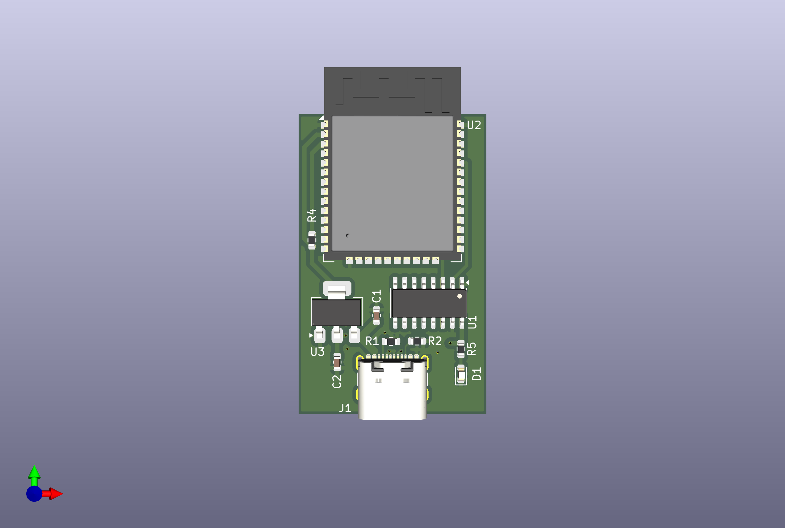

## USB to Serial Converter (CH340C + ESP32)

A compact USB-to-Serial interface board built around the CH340C and ESP32-WROOM-32E, designed in KiCad. Useful for debugging, flashing firmware, or serial interfacing.

### Features
- USB-C input
- AMS1117-based 3.3V regulation
- CH340C for USB-to-UART conversion
- ESP32-WROOM-32E footprint
- Status LED
- Clean routing and optimized trace widths

### Schematic & Layout

*Schematic:*

*PCB Layout:*

*Render:*
 

### Skills Demonstrated
- PCB layout in KiCad (2-layer)
- Component footprint and symbol management
- USB routing (D+/D- impedance aware)
- Power distribution (VBUS to LDO to 3.3V)
- Schematic capture and electrical rule checking

### Files
- `KiCad_files/` contains editable schematic and pcb layout files
- `exports/` contains rendered schematic and board images
- `BOM/` includes component list for sourcing

### License
[MIT License](LICENSE)
